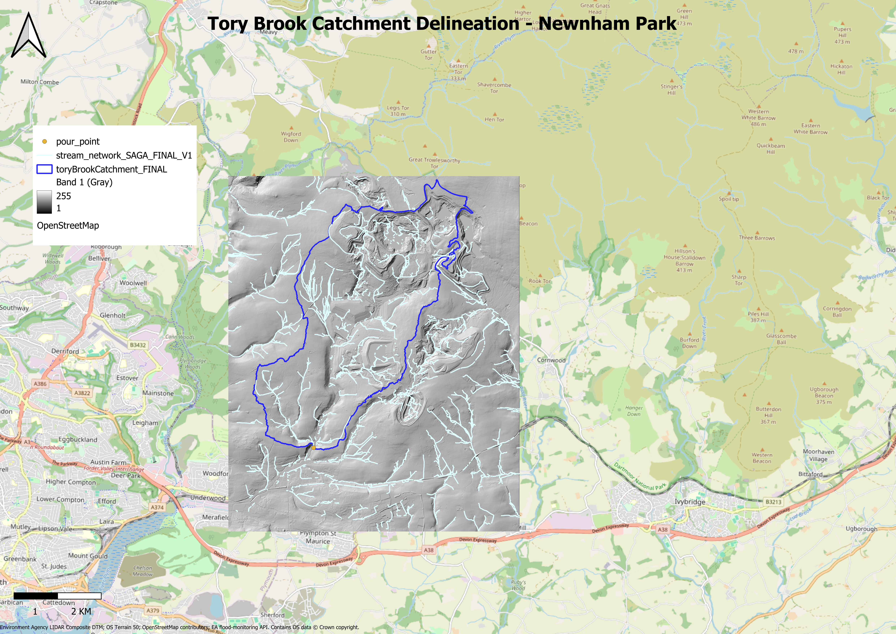

# Tory Brook Catchment Delineation & Storm Response Analysis
A civil engineering GIS portfolio project delineating the Tory Brook sub-catchment (River Plym, Devon, UK) and analysing its hydrological response to a real storm event.
# Overview
This project uses LIDAR elevation data and hydrological GIS tools to:
- Outline the ~15 km² Tory Brook catchment draining to the Newnham Park gauge
- Extract the stream network from the terrain
- Analyse rainfall vs. river level response during a real, documented storm event, validated against an official Environment Agency flood alert
 [[Read the full methodology summary](https://github.com/MasonJH07/tory-brook-catchment-delineation/blob/main/Tory%20Brook%20Catchment%20Delineation%20%26%20Storm%20Response%20Analysis.pdf)](Tory_Brook_Catchment_Delineation___Storm_Response_Analysis.pdf)
# Final Map

[Download high-resolution PDF](tory_brook_final_map.pdf)
# Storm Response Analysis
For the 11–12 November 2025 storm event, the smaller Tory Brook catchment responded ~1h 15min faster than the larger River Plym catchment, consistent with catchment scale governing hydrological response time and validated against a real EA flood alert issued for the event.

[Read the full storm analysis write-up](Step_14_Rainfall_vs__River_Level_Analysis_Summary.pdf)
[View the merged/cleaned dataset (CSV)](tory_brook_storm_merged_data.csv)
## Tools & Data Sources
- QGIS,GRASS GIS,SAGA GIS
- Environment Agency LIDAR Composite DTM
- Ordnance Survey Terrain 50
- Environment Agency Flood Monitoring API
- OpenStreetMap
# Author
Mason Howe, Civil Engineering BEng, Plymouth University
